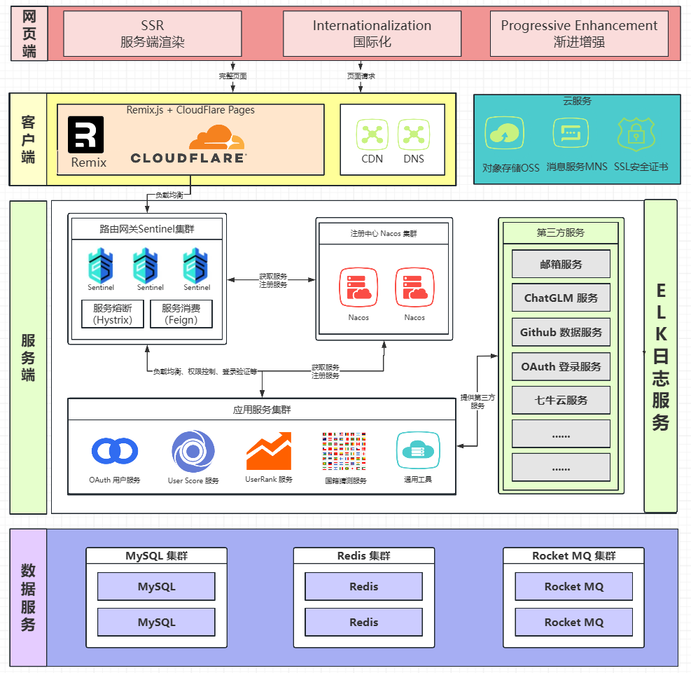
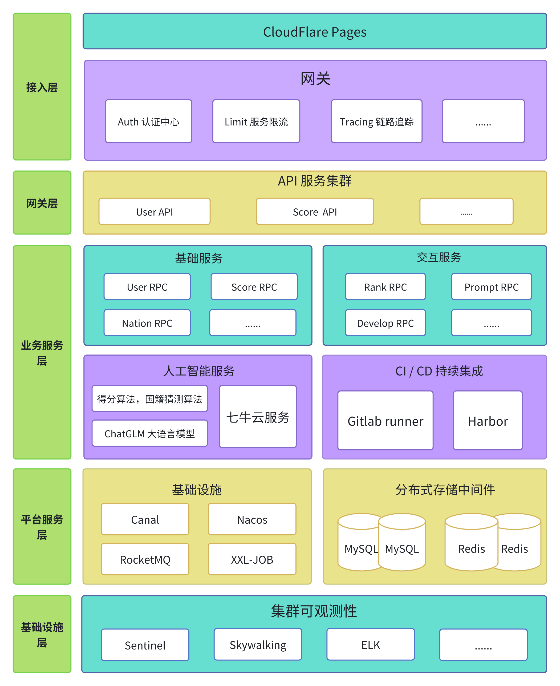

<div align="center">

[](https://geniusrank.heuluck.top/)
GitHub 用户数据查看、分析、国籍猜测与信息卡片展示

</div>

# 📖 简介

GeniusRank 是一个开发者评估应用，致力于为用户提供 GitHub 用户数据查看、分析、评价与国籍猜测等服务。

-   GeniusRank 专注于对 GitHub 上的开发者进行全面的能力评估和国籍猜测。在开发者能力评估方面，通过分析项目重要程度以及开发者在项目中的贡献度，采用类似 Google 搜索的 PageRank 机制，指数退避算法和 osu 的 pp 算法对开发者技术能力进行评价和评级。
-   GeniusRank 接入了 ChatGLM 大模型，对于开发者的国籍信息，若其 Profile 中未明确写明，可通过其关系网络进行猜测。
-   GeniusRank 提供排行榜查看，可根据开发者的领域进行搜索匹配，并按 TalentRank 排序，Nation 可作为可选筛选项，方便用户仅查看特定国家 / 地区的开发者。
-   GeniusRank 提供分数卡片导出，支持展示自己的分数和评级
-   前端使用了 Remix 和 TS 语言开发，除了 OAuth 登录，对开发者技术能力进行评价和评级，搜索 Github 用户分析数据，排行榜等众多基础功能之外，GeniusRank 还提供了卡片导出，ChatGLM 特色评估等特色功能，提高了功能的完备性。
-   后端部分使用 Java 语言微服务框架 SpringCloud，以 MyBatis-Plus 作为 ORM 框架，Nacos 作为服务的注册和发现，Redis 作为缓存，MySQL 进行持久化。使用 XXL-JOB 进行定时任务分配。使用 RocketMQ 作为消息队列，实现服务之间的解耦和流量削峰。
-   系统可观测性上，GeniusRank 引入 Sentinel 进行服务熔断和限流。使用 SkyWalking，实现对服务性能和资源的实时监控和可视化展示
    项目详细介绍请看 docs

# 🚀 功能演示

[👀 仓库地址](https://github.com/Team-DuiDuiDui/GeniusRank)
[📚 接口文档](https://apifox.com/apidoc/shared-9686d680-3909-4a99-af4c-41c6120c169e)
🥽 视频地址

# 📦 使用方法

## 后端

### 克隆项目到本地

```bash
git clone git@github.com:Team-DuiDuiDui/GeniusRank.git
```

### 导入到 IDE

IDEA 导入 Maven 项目，等待依赖下载完成。( jdk 版本要求为 17，maven 版本要求为 3.9.6+)

### 配置数据库（MySQL / Redis）

在 gateway-service，user-service，analyze-service 包下修改 shardingsphere-config-dev.yaml 中配置 mysql 数据库连接信息
执行 resources/database 包 project.sql 初始化数据库表结构。

在 gateway, user, analyze 包下修改 application.yml 中配置 redis 连接信息

### 配置第三方服务

#### 配置 RocketMQ 服务

```yaml
rocketmq:
    name-server: # RocketMQ name-server
    producer:
        group: # RocketMQ producer-group
        send-message-timeout: 2000
        retry-times-when-send-failed: 1
        retry-times-when-send-async-failed: 1
```

#### 配置 QQ-Mail 服务

```yaml
mail:
    enable: false #是否开启邮箱验证码服务
    host: smtp.qq.com #邮箱服务器地址
    username: #发送者邮箱
    password: #发送者邮箱授权码
    project-name: General-Project #项目名称
```

#### 配置 AliOSS 服务

```yaml
alioss:
    enable: false #是否开启阿里云 OSS 服务，如不开启则采用本地存储
    endpoint: #阿里云 OSS（对象存储服务）的访问域名
    access-key-id: #用于访问 OSS 的标识用户的唯一标识符
    access-key-secret: #用于访问 OSS 的配对密钥
    bucket-name: #OSS 中的存储空间名称
    domain: 127.0.0.1:9000 #本地存储空间域名，如不采用 alioss，则该存储空间为兜底
```

### 启动项目

首先先在本地启动 redis，nacos，rocketmq 服务
然后再依次启动 user-service, analyze-service, gateway-service 服务即可。

## 前端

### 运行

首先确保你已经安装了 [Node.js](https://nodejs.org/) v22.2 或以上并已启用了 [Corepack](https://nodejs.org/api/corepack.html)

#### 安装依赖

执行以下命令安装依赖

```bash
$ yarn
```

#### 配置环境变量

在前端文件根目录下创建`.dev.vars`文件，按注释在 GitHub 生成并写入相应信息

```yaml
GITHUB_ACCESS_TOKEN = # 生成的 GitHub Fine-grained personal access tokens
GITHUB_CLIENT_ID = # 生成的 GitHub OAuth Client ID
GITHUB_CLIENT_SECRET = # 生成的 GitHub OAuth Client Secret
BASE_URL = # 后端 BASE_URL
```

### 启动项目

执行以下命令运行项目

```bash
$ yarn dev
```

### 部署

由于使用了 Remix CloudFlare Adaptor，需部署在 CloudFlare Pages 上。构建前需设置 Secret。

# 🖥️ 技术架构

## 总体架构

GeniusRank 前端及其服务端使用 Remix.js，后端使用 Spring-Cloud 作为微服务框架，包括 API 层和 RPC 层。API 层与前端交互，提供功能中间件。RPC 层实现业务逻辑，使用 Nacos 进行服务注册和发现。存储方面，使用 MySQL 持久化、 Redis 作为缓存、RocketMQ 作为消息队列。算法支持包括得分算法，国籍猜测算法和语言大模型。服务可观测性通过链路追踪和服务监控实现。


## 前端架构
使用 [Remix.js](https://remix.run/) 框架构建（包含用户界面与 Remix 服务端），以 Tailwind 作为 CSS 框架，利用 TypeScript 与 Zod 进行类型检查，使用 i18next 实现多语言服务，以 Mantine 为前端 UI 与图表组件库，部署于 CloudFlare Pages。

支持服务端渲染（SSR），在必要处均遵循渐进增强原则，可以在无 JavaScript 的情况下使用最基本功能；同时支持增量静态生成(ISSG)与静态生成(SSG)，减少 Remix 服务端压力，提升用户体验。

## 后端架构

选择了基于 Spring Boot 3 和 JDK17 进行底层建设，同时组件库的版本大多也是最新的。这样做既能享受新技术带来的性能提升，也能体验到新特性带来的惊喜。
技术架构涵盖了 SpringBoot 3、SpringCloudAlibaba、Nacos、Sentinel、Skywalking、RocketMQ 5.x、Redis、MySQL、EasyExcel、Redisson 等技术。
框架技术和版本号关系如下表格所示。

| 序号 | 技术                | 名称               | 版本           | 官网                                            |
| ---- | ------------------- | ------------------ | -------------- | ----------------------------------------------- |
| 1    | Spring Boot         | 基础框架           | 3.0.7          | https://spring.io/projects/spring-boot          |
| 2    | SpringCloud Alibaba | 分布式框架         | 2022.0.0.0-RC2 | https://github.com/alibaba/spring-cloud-alibaba |
| 3    | SpringCloud Gateway | 网关框架           | 2022.0.3       | https://spring.io/projects/spring-cloud-gateway |
| 4    | MyBatis-Plus        | 持久层框架         | 3.5.7          | https://baomidou.com                            |
| 5    | MySQL               | OLTP 关系型数据库  | 5.7.36         | https://www.mysql.com/cn                        |
| 6    | Redis               | 分布式缓存数据库   | Latest         | https://redis.io                                |
| 7    | RocketMQ            | 消息队列           | 2.3.0          | https://rocketmq.apache.org                     |
| 8    | ShardingSphere      | 数据库生态系统     | 5.3.2          | https://shardingsphere.apache.org               |
| 9    | FastJson2           | JSON 序列化工具    | 2.0.36         | https://github.com/alibaba/fastjson2            |
| 10   | Canal               | BinLog 订阅组件    | 1.1.6          | https://github.com/alibaba/canal                |
| 11   | HuTool              | 小而全的工具集项目 | 5.8.27         | https://hutool.cn                               |
| 12   | Maven               | 项目构建管理       | 3.9.1          | http://maven.apache.org                         |
| 13   | Redisson            | Redis Java 客户端  | 3.27.2         | [https://redisson.org](https://redisson.org/)   |
| 14   | Sentinel            | 流控防护框架       | 1.8.6          | https://github.com/alibaba/Sentine              |

# 🧑‍💻 贡献者

| 团队成员 | 主要工作                                                                 |
| -------- | ------------------------------------------------------------------------ |
| 王朝伟   | 后端架构设计，用户模块，大模型模块，算法设计，缓存设计，限流，服务监控等 |
| 陆永祥   | 前端架构设计，样式设计，GitHub 用户数据获取、查看、分析，代码审查，服务端渲染等        |
| 张润诚   | 前端架构设计，国籍猜测模块、猜测与置信度算法设计等                                             |
<!-- [](https://github.com/Team-DuiDuiDui/GeniusRank/graphs/contributors) -->