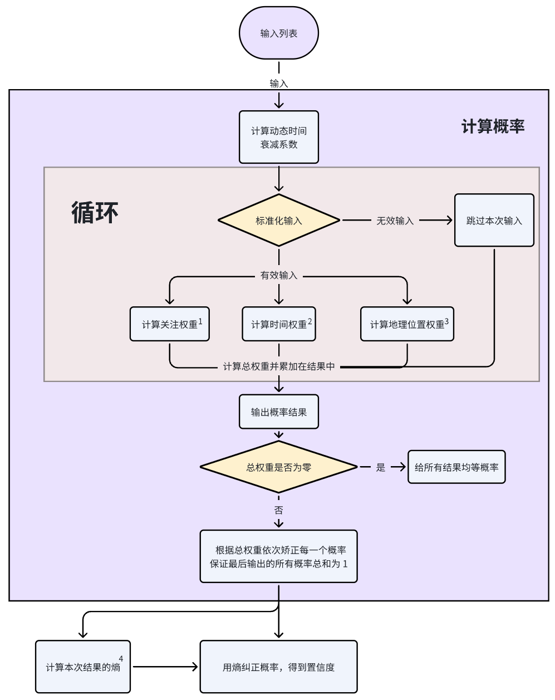

# userNation 推测思路

1. 后端数据检测：首先，通过后端接口检查用户的国籍数据是否已存在。如果存在，则携带其置信度一起返回，供后续使用。

2. 实时国籍重新判断：至少采用一种实时方式重新判断 userNation，并与后端保存的数据进行比较：

    * 如果两者相同，且实时判断的置信度更高，则更新后端数据，提高置信度。
    * 如果两者不同，则需重新评估后端数据的可信度，必要时更新后端数据。

3. 多渠道国籍推测：

    * 大型语言模型（GLM）推测：对于粉丝数量超过 50,000 的用户（即可能是具有影响力的公众人物），使用 GLM 结合现有数据进行国籍推测。如果无法判断，则继续下一步。
    * 从个人仓库 README 中提取信息：如果个人仓库存在同名仓库，且某个分支下有 README.md 文件，则解析该文件，判断用户是否明确声明了自己的国籍。如果无法判断，则继续下一步。
    * 如果粉丝数量少于 50 但声明了自己的 location，则判断为没有足够数据量，沿用 github 中自己设置的 location。如果无法判断，则继续下一步。
    * 基于粉丝的国籍推测：从用户的粉丝列表中获取信息，使用高级算法进行国籍推测，详见下文。

# 基于 followers & followings 的 nation 推测

## 算法整体思路

算法的目标是通过综合考虑以下因素来预测用户的国籍：

- **时间衰减权重**：早期的粉丝或关注者对用户国籍的影响更大。
- **社交影响力权重**：粉丝或关注者的社交活跃程度对权重有影响。
- **地理位置权重**：粉丝或关注者的地理位置频率和全球分布。
- **先验概率调整**：结合全球用户分布，调整地理位置的权重。
- **信息量的引入**：罕见的地理位置携带更多的信息量。
- **置信度计算**：基于熵的计算，得到预测结果的置信度。
---
## 算法主要内容
$$
\text{Result} = \left\{ \left( L,\, P_{\text{norm}}(L),\, c \cdot P_{\text{norm}}(L) \right) \,\bigg|\, L \in \mathcal{L} \right\}
$$
**完整公式（使用原始变量）：**

$$
P_{\text{norm}}(L) = \dfrac{
    \displaystyle\sum_{U \in \{ U_{\text{fans}}, U_{\text{followers}} \}} \sum_{i=0}^{N_U - 1} \delta(L_i, L) \cdot e^{ -\alpha_U t_i } \cdot \dfrac{1}{1 + \ln(1 + \min(n_i + 1, n_{\text{max}}))} \cdot \left( -\ln\left( \max\left( P(L_i), 1 \times 10^{-6} \right) \right) \right)
}{
    \displaystyle\sum_{U \in \{ U_{\text{fans}}, U_{\text{followers}} \}} \sum_{i=0}^{N_U - 1} e^{ -\alpha_U t_i } \cdot \dfrac{1}{1 + \ln(1 + \min(n_i + 1, n_{\text{max}}))} \cdot \left( -\ln\left( \max\left( P(L_i), 1 \times 10^{-6} \right) \right) \right)
}
$$

**简化公式（使用下面的标号部分）：**

$$
P_{\text{norm}}(L) = \dfrac{
    \displaystyle\sum_{U} \sum_{i=0}^{N_U - 1} \delta(L_i, L) \cdot T(t_i) \cdot W_{\text{social}}(n_i) \cdot I(c_k)
}{
    \displaystyle\sum_{U} \sum_{i=0}^{N_U - 1} T(t_i) \cdot W_{\text{social}}(n_i) \cdot I(c_k)
}
$$
里面包含了下面主要的 11 个部分

## 详细说明

### 1. 时间衰减权重

**目的**：早期的粉丝或关注者通常与用户关系更密切，有更大概率是用户的身边的朋友之类的人，因此在预测中应赋予更大的权重。

**数学模型**：

- **指数衰减函数**：

  $$
  T(t_i) = e^{-\alpha t_i}
  $$

  其中，$t_i$ 为用户在列表中的索引位置，$\alpha$ 为时间衰减系数。

- **时间衰减系数 $\alpha$**：

  $$
  \alpha = \begin{cases}
  \dfrac{2 \ln 2}{N} & \text{如果 } N > 0 \\
  0.01 & \text{如果 } N \leq 0
  \end{cases}
  $$

  其中，$N$ 为列表长度。这样确保在列表中间位置，时间权重减半。

**解决的问题**：通过时间衰减，使得早期的粉丝或关注者在预测中占更大的比重。

---

### 2. 社交影响力权重

**目的**：因为影响力越大的用户因为地理位置靠近所以和被调查者产生关系的可能越小，所以在这里重新校验一下权重。

**数学模型**：

- **社交影响力权重函数**：

  $$
  W_{\text{social}}(n_i) = \frac{1}{1 + \log(1 + n_i)}
  $$

  其中，$n_i$ 为用户的粉丝数或关注数。

- **异常值处理**：设置最大阈值 $n_{\text{max}}$，调整 $n_i$：

  $$
  n_i' = \min(n_i + 1, n_{\text{max}})
  $$

**解决的问题**：降低高粉丝数或高关注数用户对权重的过度影响。

---

### 3. 地理位置标准化

**目的**：将用户提供的地理位置信息标准化，便于匹配和统计。

**实现思路**：

- 去除"NULL"、"null" 等空值和无效值。
- 对地理位置字符串进行清洗和统一格式化。

**解决的问题**：可能有部分用户没有自己添加 location 字段，导致这些数据没有办法作为有效数据。

---

### 4. 信息量的引入

**目的**：罕见的地理位置携带更多的信息量，应该在权重中体现。

**数学模型**：

- **信息量计算**：

  $$
  P_i = P(L_i)
  $$

  $$
  p'_i = \max(p_i, 10^{-6})
  $$

  $$
  I_i = -\ln(p'_i)
  $$

  其中，$P(i)$ 为地理位置 $i$ 的先验概率。

**解决的问题**：因为本来用户数量就少的国家的人出现在被调查者的关系网中的概率就低，所以需要增加来自全球用户比例较小的国家或地区的粉丝对预测的权重。

---

### 5. 先验概率的获取

**目的**：结合全球用户的地理分布，获取各地理位置的先验概率。

**实现思路**：

- 从全球用户分布数据中获取每个国家或地区的用户比例，形成先验概率表 `globalLocationDistribution`。
- 数据来源均为网络上的公开资料：[GitHub 开源项目](http://47.121.222.224:30013/#/) 和 GitHub 2021 年官方报告文档

**解决的问题**：在预测中考虑全球用户的地理分布，提高预测的准确性。

---

### 6. 权重的综合计算

**数学模型**：

- **单个用户的权重计算**：

  $$
  \text{weight}_i = T(t_i) \times W_{\text{social}}(n_i) \times I(c_k)
  $$

  其中，$T(t_i)$ 为时间衰减权重，$W_{\text{social}}(n_i)$ 为社交影响力权重，$I(c_k)$ 为信息量。

- **总权重的计算**：

  $$
  W(c_k) = \sum_{i \in c_k} \text{weight}_i
  $$

  其中，对所有地理位置为 $c_k$ 的用户，累加权重。

**解决的问题**：综合考虑多个因素，计算每个地理位置的综合权重。

---

### 7. 后验概率的计算

**目的**：基于综合权重，计算用户属于各地理位置的后验概率。

**数学模型**：

- **后验概率**：

  $$
  P(c_k | D) = \frac{W(c_k)}{\sum_j W(c_j)}
  $$

  其中，$D$ 为数据集，$W(c_k)$ 为地理位置 $c_k$ 的总权重。

**解决的问题**：得到用户属于各地理位置的概率分布。

---

### 8. 预测结果熵的计算

**目的**：衡量预测结果的可靠性，置信度越高，预测结果越可信。

**数学模型**：

- **熵的计算**：

  $$
  H = -\sum_{L \in \mathcal{L}} P_{\text{posterior}}(L) \ln P_{\text{posterior}}(L)
  $$

- **熵的归一化**：

  $$
  H_{\text{max}} = \ln |\mathcal{L}|
  $$

  $$
  H_{\text{norm}} = \dfrac{H}{H_{\text{max}}}
  $$

  其中，$\mathcal{L}$ 为不同地理位置的数量。

- **置信度**：

  $$
  \text{Confidence} = 1 - H_{\text{norm}}
  $$

- **置信度范围约束**：

  $$
  \text{Confidence} = \max(0, \min(1, \text{Confidence}))
  $$

**解决的问题**：提供预测结果的可靠性指标，方便评估和比较。

---

### 9.合并粉丝和关注者列表的结果

在分别处理两个列表以获得 $P_{\text{fans}}(L)$、$c_{\text{fans}}$ 和 $P_{\text{followers}}(L)$、$c_{\text{followers}}$ 后，合并结果：

a. **每个位置的综合概率**：

$$
P_{\text{combined}}(L) = P_{\text{fans}}(L) + P_{\text{followers}}(L)
$$

b. **每个位置的综合置信度**：

$$
c_{\text{combined}}(L) = c_{\text{fans}}(L) + c_{\text{followers}}(L)
$$

---

### 10.归一化综合概率和置信度

a. **综合概率总和**：

$$ 
P_{\text{total}} = \sum_{L \in \mathcal{L}} P_{\text{combined}}(L)
$$

b. **每个位置的归一化概率**：

$$
P_{\text{normalized}}(L) = \begin{cases}
\dfrac{P_{\text{combined}}(L)}{P_{\text{total}}} & \text{如果 } P_{\text{total}} > 0 \\
\dfrac{1}{|\mathcal{L}|} & \text{如果 } P_{\text{total}} = 0
\end{cases}
$$

---
## 注意事项

- ~~**地理位置标准化**：由于 glm 的不确定性，可能会导致构造返回的国家信息并不是标准 ISO~~ **已修复**
- **数据质量**：算法的准确性依赖于早期关注者 location 的完整性
