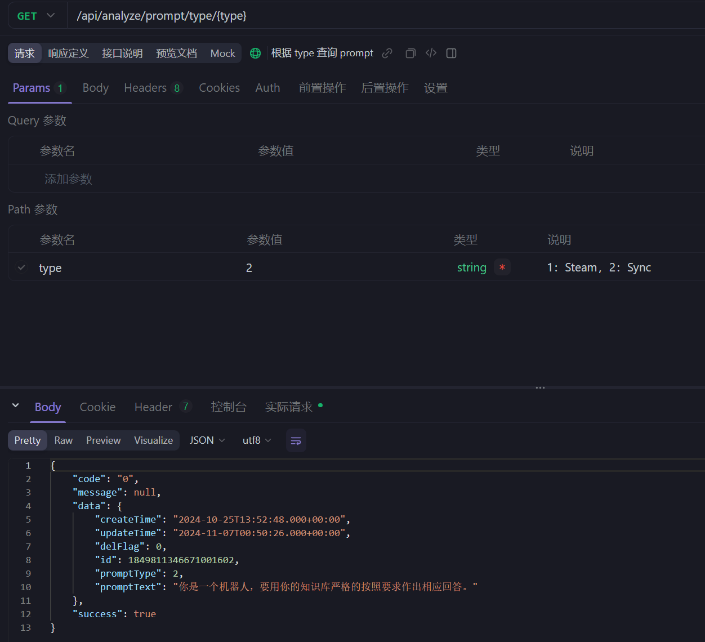

# 一、项目介绍

GeniusRank 是一个开发者评估应用，致力于为用户提供 GitHub 用户数据查看、分析、评价与国籍猜测等服务。

-   GeniusRank 专注于对 GitHub 上的开发者进行全面的能力评估和国籍猜测。在开发者能力评估方面，通过分析项目重要程度以及开发者在项目中的贡献度，采用类似 Google 搜索的 PageRank 机制，指数退避算法和 osu 的 pp 算法对开发者技术能力进行评价和评级。
-   GeniusRank 接入了 ChatGLM 大模型，对于开发者的国籍信息，若其 Profile 中未明确写明，可通过其关系网络进行猜测。
-   GeniusRank 提供排行榜查看，可根据开发者的领域进行搜索匹配，并按 TalentRank 排序，Nation 可作为可选筛选项，方便用户仅查看特定国家 / 地区的开发者。
-   GeniusRank 提供分数卡片导出，支持展示自己的分数和评级
-   前端使用了 Remix 和 TS 语言开发，除了 OAuth 登录，对开发者技术能力进行评价和评级，搜索 Github 用户分析数据，排行榜等众多基础功能之外，GeniusRank 还提供了卡片导出，ChatGLM 特色评估等特色功能，提高了功能的完备性。
-   后端部分使用 Java 语言微服务框架 SpringCloud，以 MyBatis-Plus 作为 ORM 框架，Nacos 作为服务的注册和发现，Redis 作为缓存，MySQL 进行持久化。使用 XXL-JOB 进行定时任务分配。使用 RocketMQ 作为消息队列，实现服务之间的解耦和流量削峰。
-   系统可观测性上，GeniusRank 引入 Sentinel 进行服务熔断和限流。使用 SkyWalking，实现对服务性能和资源的实时监控和可视化展示


# 二、项目分工

## 2.1 代码分工
| 团队成员 | 主要工作                                                                 |
| -------- | ------------------------------------------------------------------------ |
| 王朝伟   | 后端架构设计，用户模块，大模型模块，算法设计，缓存设计，限流，服务监控等 |
| 陆永祥   | 前端架构设计，样式设计，GitHub 用户数据获取、查看、分析，代码审查，服务端渲染等        |
| 张润诚   | 前端架构设计，国籍猜测模块、猜测与置信度算法设计等                                             |

## 2.2 项目开发流程

### 2.2.1 项目运行/部署说明

#### 后端

##### 克隆项目到本地

```bash
git clone git@github.com:Team-DuiDuiDui/GeniusRank.git
```

##### 导入到 IDE

IDEA 导入 Maven 项目，等待依赖下载完成。( jdk 版本要求为 17，maven 版本要求为 3.9.6+)

##### 配置数据库（MySQL / Redis）

在 gateway-service，user-service，analyze-service 包下修改 shardingsphere-config-dev.yaml 中配置 mysql 数据库连接信息
执行 resources/database 包 project.sql 初始化数据库表结构。

在 gateway, user, analyze 包下修改 application.yml 中配置 redis 连接信息

##### 配置第三方服务

###### 配置 RocketMQ 服务

```yaml
rocketmq:
    name-server: # RocketMQ name-server
    producer:
        group: # RocketMQ producer-group
        send-message-timeout: 2000
        retry-times-when-send-failed: 1
        retry-times-when-send-async-failed: 1
```

###### 配置 QQ-Mail 服务

```yaml
mail:
    enable: false #是否开启邮箱验证码服务
    host: smtp.qq.com #邮箱服务器地址
    username: #发送者邮箱
    password: #发送者邮箱授权码
    project-name: General-Project #项目名称
```

###### 配置 AliOSS 服务

```yaml
alioss:
    enable: false #是否开启阿里云 OSS 服务，如不开启则采用本地存储
    endpoint: #阿里云 OSS（对象存储服务）的访问域名
    access-key-id: #用于访问 OSS 的标识用户的唯一标识符
    access-key-secret: #用于访问 OSS 的配对密钥
    bucket-name: #OSS 中的存储空间名称
    domain: 127.0.0.1:9000 #本地存储空间域名，如不采用 alioss，则该存储空间为兜底
```

##### 启动项目

首先先在本地启动 redis，nacos，rocketmq 服务
然后再依次启动 user-service, analyze-service, gateway-service 服务即可。

#### 前端

##### 运行

首先确保你已经安装了 [Node.js](https://nodejs.org/) v22.2 或以上并已启用了 [Corepack](https://nodejs.org/api/corepack.html)

###### 安装依赖

执行以下命令安装依赖

```bash
$ yarn
```

###### 配置环境变量

在前端文件根目录下创建`.dev.vars`文件，按注释在 GitHub 生成并写入相应信息

```
# 生成的 GitHub Fine-grained personal access tokens
GITHUB_ACCESS_TOKEN =
# 生成的 GitHub OAuth Client ID
GITHUB_CLIENT_ID =
# 生成的 GitHub OAuth Client Secret
GITHUB_CLIENT_SECRET =
# 后端 BASE_URL
BASE_URL =
```

##### 启动项目

执行以下命令运行项目

```bash
$ yarn dev
```

##### 部署

由于使用了 Remix CloudFlare Adaptor，需部署在 CloudFlare Pages 上。构建前需设置 Secret。


### 2.2.2 项目运行状态

#### CloudFlare Pages


#### Harbor


#### Rancher


# 三、项目实现

## 3.1 技术选型
### 3.1.1 前端
* 前端框架：Remix.js
* 编程语言：TypeScript
* 实用工具库：React Countup
* UI库：Mantine, React hot toast
* CSS框架: Tailwind
* 前端构建工具：Vite
* 网络请求库：Axios
* 部分网络请求方式：fetch
* 包管理工具：yarn@4.5.0
* 类型检查库: Zod
* 版本控制工具：Git

### 3.1.2 后端
* 微服务框架：Spring-Cloud
* 数据库： MySQL
* ORM框架：Mybatis-Plus
* 中间件： Redis、RocketMQ、XXL-JOB
* 管理面板：Sentinel、SkyWalking
* 服务发现：Nacos
* 大语言模型：ChatGLM
* 存储服务器：阿里云
* 数据同步：Canal
* CI/CD: GitLab CI，Harbor

### 3.1.3 核心服务

| 服务名            | 作用                                                                            |
|----------------|-------------------------------------------------------------------------------| 
| User 服务        | 提供 OAuth 登录、注册、修改个人信息、上传图片和鉴权服务                                               |
| Score 服务       | 提供 Github 用户分数算法，提供用户 Github 数据分析、评价。接入 ChatGLM 服务提供 Github 用户特色分析            |
| Nation 服务      | 提供 Github 用户国籍猜测算法，若其 Profile 中未明确写明，可通过其关系网络进行猜测。接入 ChatGLM 服务提供分析。          |
| DevelopType 服务 | 记录 Github 用户开发者领域信息                                                           |
| Rank 服务        | 提供排行榜查看，可根据开发者的领域进行搜索匹配，并按 TalentRank 排序，Nation 可作为可选筛选项，方便用户仅查看特定国家 / 地区的开发者 |
| ChatGLM 服务     | 支持 Prompt 修改，同步和流式请求，接入大模型给 Github 用户提供服务                                     |

## 3.2 结构设计

### 3.2.1 技术架构


GeniusRank 前端及其服务端使用 Remix.js，后端使用 Spring-Cloud 作为微服务框架，包括 API 层和 RPC 层。API 层与前端交互，提供功能中间件。RPC 层实现业务逻辑，使用 Nacos 进行服务注册和发现。存储方面，使用 MySQL 持久化、 Redis 作为缓存、RocketMQ 作为消息队列。算法支持包括得分算法，国籍猜测算法和语言大模型。服务可观测性通过链路追踪和服务监控实现。

### 3.2.2 前端架构图


使用 Remix.js 框架构建（包含用户界面与 Remix 服务端），以 Tailwind 作为 CSS 框架，利用 TypeScript 与 Zod 进行类型检查，使用 i18next 实现多语言服务，以 Mantine 为前端 UI 与图表组件库，部署于 CloudFlare Pages。

支持服务端渲染（SSR），在必要处均遵循渐进增强原则，可以在无 JavaScript 的情况下使用最基本功能；同时支持增量静态生成(ISSG)与静态生成(SSG)，减少 Remix 服务端压力，提升用户体验。

### 3.2.3 后端架构图


选择了基于 Spring Boot 3 和 JDK17 进行底层建设，同时组件库的版本大多也是最新的。这样做既能享受新技术带来的性能提升，也能体验到新特性带来的惊喜。
技术架构涵盖了 SpringBoot 3、SpringCloudAlibaba、Nacos、Sentinel、Skywalking、RocketMQ 5.x、Redis、MySQL、EasyExcel、Redisson 等技术。
框架技术和版本号关系如下表格所示。

| 序号 | 技术                | 名称               | 版本           | 官网                                            |
| ---- | ------------------- | ------------------ | -------------- | ----------------------------------------------- |
| 1    | Spring Boot         | 基础框架           | 3.0.7          | https://spring.io/projects/spring-boot          |
| 2    | SpringCloud Alibaba | 分布式框架         | 2022.0.0.0-RC2 | https://github.com/alibaba/spring-cloud-alibaba |
| 3    | SpringCloud Gateway | 网关框架           | 2022.0.3       | https://spring.io/projects/spring-cloud-gateway |
| 4    | MyBatis-Plus        | 持久层框架         | 3.5.7          | https://baomidou.com                            |
| 5    | MySQL               | OLTP 关系型数据库  | 5.7.36         | https://www.mysql.com/cn                        |
| 6    | Redis               | 分布式缓存数据库   | Latest         | https://redis.io                                |
| 7    | RocketMQ            | 消息队列           | 2.3.0          | https://rocketmq.apache.org                     |
| 8    | ShardingSphere      | 数据库生态系统     | 5.3.2          | https://shardingsphere.apache.org               |
| 9    | FastJson2           | JSON 序列化工具    | 2.0.36         | https://github.com/alibaba/fastjson2            |
| 10   | Canal               | BinLog 订阅组件    | 1.1.6          | https://github.com/alibaba/canal                |
| 11   | HuTool              | 小而全的工具集项目 | 5.8.27         | https://hutool.cn                               |
| 12   | Maven               | 项目构建管理       | 3.9.1          | http://maven.apache.org                         |
| 13   | Redisson            | Redis Java 客户端  | 3.27.2         | [https://redisson.org](https://redisson.org/)   |
| 14   | Sentinel            | 流控防护框架       | 1.8.6          | https://github.com/alibaba/Sentine              |

### 3.2.4 数据库ER图


# 四、项目测试
## 4.1 项目结构

### 4.1.1 前端
```
├─app
│  ├─api
│  │  ├─backend
│  │  │  └─typings
│  │  └─github
│  │      ├─graphql
│  │      │  └─typings
│  │      └─rest
│  │          ├─schema
│  │          └─typings
│  ├─assets
│  │  └─css
│  ├─components
│  │  ├─constant
│  │  ├─ranking
│  │  └─userinfo
│  │      └─detail
│  ├─config
│  ├─hooks
│  ├─locales
│  ├─modules
│  ├─routes
│  │  ├─card.$name
│  │  ├─detail.$name
│  │  └─user.$name
│  └─utils
│      ├─auto-animate-plugin
│      └─region
├─functions
└─public
```
### 4.1.2 后端模块
```
├─aggregation-service // 聚合服务
│  ├─src
│  │  └─main
│  │      ├─java
│  │      │  └─com
│  │      │      └─nine
│  │      │          └─project
│  │      │              └─aggregation
│  │      └─resources
├─analyze-service // 分析服务
│  ├─src
│  │  └─main
│  │      ├─java
│  │      │  └─com
│  │      │      └─nine
│  │      │          └─project
│  │      │              └─analyze
│  │      │                  ├─config
│  │      │                  ├─constant
│  │      │                  ├─controller
│  │      │                  ├─dao
│  │      │                  │  ├─entity
│  │      │                  │  └─mapper
│  │      │                  ├─dto
│  │      │                  │  ├─req
│  │      │                  │  └─resp
│  │      │                  ├─mq
│  │      │                  │  ├─consumer
│  │      │                  │  ├─event
│  │      │                  │  └─produce
│  │      │                  ├─service
│  │      │                  │  └─impl
│  │      │                  └─toolkit
│  │      └─resources
│  │          └─mapper
├─framework // 通用模块
│  ├─src
│  │  └─main
│  │      ├─java
│  │      │  └─com
│  │      │      └─nine
│  │      │          └─project
│  │      │              └─framework
│  │      │                  ├─biz
│  │      │                  │  └─user
│  │      │                  ├─config
│  │      │                  ├─database
│  │      │                  │  ├─base
│  │      │                  │  ├─config
│  │      │                  │  ├─handler
│  │      │                  │  └─page
│  │      │                  ├─errorcode
│  │      │                  ├─exception
│  │      │                  ├─result
│  │      │                  ├─toolkit
│  │      │                  └─web
│  │      └─resources
│  │          └─META-INF
│  │              └─spring
├─gateway-service // 网关服务
│  ├─src
│  │  └─main
│  │      ├─java
│  │      │  └─com
│  │      │      └─nine
│  │      │          └─project
│  │      │              └─gateway
│  │      │                  ├─config
│  │      │                  ├─constant
│  │      │                  └─filter
│  │      └─resources
│  └─target
│      ├─classes
│      │  └─com
│      │      └─nine
│      │          └─project
│      │              └─gateway
│      │                  ├─config
│      │                  ├─constant
│      │                  └─filter
├─resources
│  ├─api
│  └─database
└─user-service // 用户服务
    ├─src
    │  └─main
    │      ├─java
    │      │  └─com
    │      │      └─nine
    │      │          └─project
    │      │              └─user
    │      │                  ├─common
    │      │                  │  ├─constant
    │      │                  │  └─serialize
    │      │                  ├─config
    │      │                  ├─controller
    │      │                  ├─dao
    │      │                  │  ├─entity
    │      │                  │  └─mapper
    │      │                  ├─dto
    │      │                  │  ├─req
    │      │                  │  └─resp
    │      │                  ├─job
    │      │                  ├─mq
    │      │                  │  ├─consumer
    │      │                  │  ├─event
    │      │                  │  └─produce
    │      │                  ├─remote
    │      │                  │  └─dto
    │      │                  │      ├─req
    │      │                  │      └─resp
    │      │                  ├─service
    │      │                  │  └─impl
    │      │                  └─toolkit
    │      └─resources
```

## 4.2 部分核心功能测试
> 全部功能文档可查询对应 ApiFox 文档示例和说明

### 4.2.1 用户接口

#### 用户 OAuth 登录


#### 用户信息获取


#### 用户信息更新


### 4.2.2 分数接口

#### 简单 Github 用户分数计算接口


#### 登录后 Github 用户分数计算接口


#### 查询 Github 用户分数接口


### 4.2.3 Github 用户国籍猜测接口

#### Github 用户国籍猜测接口


#### Github 用户国籍查询接口


### 4.2.4 排名接口

#### 排行榜查询接口


#### 查询用户分数排名接口


#### 查询已存在国籍接口/已存在开发者领域接口


### 4.2.5 ChatGLM 接口

#### 同步请求 ChatGLM 接口


#### 流式请求 ChatGLM 接口


#### 查询对应 Prompt 接口


#### 修改 Prompt 接口


